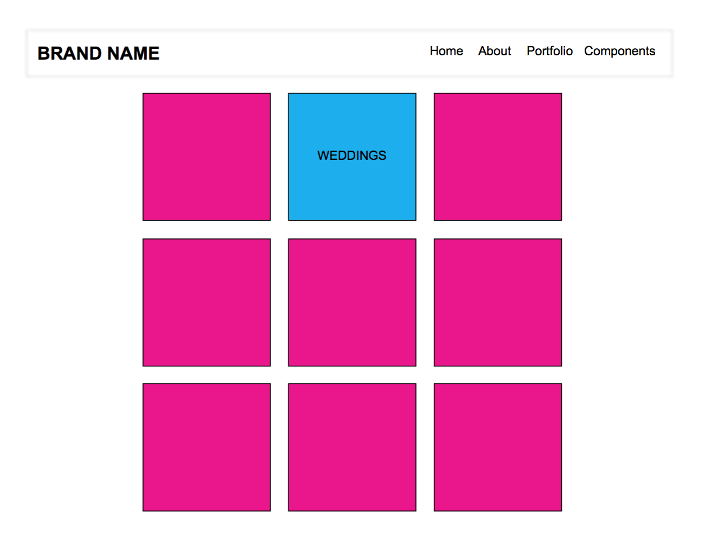

# Photography Template Site

## The App
This app is a template site geared toward photographers who want to showcase their work online. The template has an example landing page, portfolio page, gallery page and a couple of pages with various features or components that are avaialble including fontawesome icons, buttons, a form and the various typography used on the site.

## Technologies Used
HTML, CSS, Bootstrap, jQuery, jQuery plugins: slides.js, tiltedpage-scroll.js; Google fonts, fontawesome

## Approach Taken
I sketched out my ideas of what I would like the pages to look like in InDesign, and created user stories. I then filled out a trello board with the tasks I wanted to complete for the week. I thought about what MVP would be and what bonus features I would like to add. I also drew out a file tree, to make sure I organized my files in a way that made sense. I also spent some time researching and playing with different jQuery plugins to find ones I wanted to use for my site.

Next I: 
* Created a local repository and linked to GitHub 
* Gathered libraries and added those files first
* Created each page and linked them together appropriately
* Styled each page
* Deployed the site using GitHub Pages

## User Stories
* User lands on landing page for template site
* User can scroll through page
* User can view example “About us” page
* User can view example “Contact” page
* User can view example of “Portfolio” page
* User can view various features/components such as typography, buttons or icons

## Installation Instructions
* Clone the repository to your local machine
* Open in browser (localhost:3000)
* The website can be viewed online at https://sgwaite8.github.io/ as well.

## Bonus Features
I would like to explore more jQuery plugins and create a few more landing pages or gallery type pages. I found a few plugins I would like to take a look at and possibly use in the future.

## Note
All images were taken by Susannah Waite or downloaded from pexel, a free stock photo art site.

